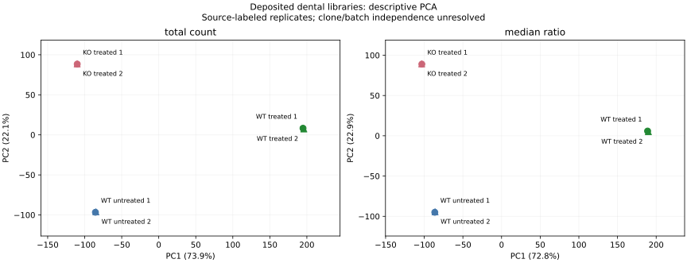
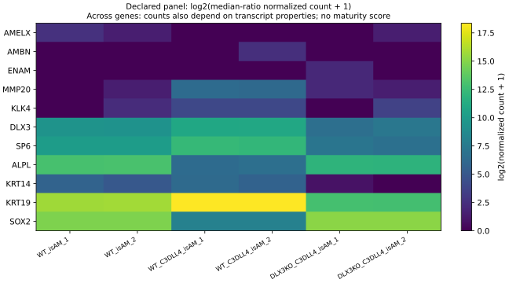

# Ameloblast RNA source context and normalization diagnostics

This AI-assisted follow-up acquired the actual primary manuscript XML and its
supplementary archive. [Retrieval receipts](primary_context_receipt.json) retain
both response hashes. Relevant supplementary PDF pages were visually reviewed,
and the companion workbook was inventoried and reviewed; its seven figure-summary
sheets contain no library-level expression or graft-outcome records. Source files
and PDF renderings remain in ignored private storage.

## What is qualified, and what remains unresolved

The [primary article](https://pmc.ncbi.nlm.nih.gov/articles/PMC12950815/) reports
six organoid RNA samples and two independent knockout clones, KO-10 and KO-13.
GEO labels the six samples as two biological replicates in each of three
conditions, all from the WTC-11 background, and links every GSM to BioSample and
SRA experiment accessions; see the sample map in [GEO_QUALIFICATION.md](GEO_QUALIFICATION.md).
The GEO labels do not identify which KO clone supplied either KO RNA library or
name independent differentiation batches. The general timeline in supplementary
Fig. S2 ends at day 31. The Results also describe a 14-day maturation interval
for transcriptomic analysis. These contextual descriptions do not certify each
GSM's harvest day or independent culture batch.

Protein, fluorescence and transcriptome observations have different scopes.
The paper's Figs. 3b and 6c use gene-wise z-score heatmaps; Figs. 3c–f and 6d–i
also contain protein/imaging measurements. Sparse RNA counts cannot be used
alone to reject those distinct assays, and a large heatmap color difference
does not establish abundant transcript expression. Library-specific sample
context remains needed to reconcile them.

## Analysis operation

The optional study runtime uses **PyDESeq2 0.5.4 solely to fit median-of-ratios
size factors**, using raw integers across all six libraries. It does not fit
dispersions or effect coefficients, perform Wald tests, or issue adjusted
p values. PyDESeq2 is a Python reimplementation with differences from R DESeq2;
this is not reproduction of the paper's R analysis.
[Package documentation](https://pydeseq2.readthedocs.io/en/stable/).

Total-count and median-ratio factor vectors are each rescaled to geometric mean
one. Normalized values consequently have comparable typical-library count
units. Descriptive panel log2 mean ratios use a pseudocount of **one normalized
count**, rather than the earlier CPM pseudocount. Comparisons between the two
new normalization methods use that same scale; magnitudes should not be
directly equated to the earlier CPM-plus-one estimates.

Median-ratio scaling assumes an appropriate reference expression distribution;
it does not correct unknown clone/batch effects, cellular mixtures, or a global
change in RNA per cell. It is a normalization sensitivity comparison, not proof
that one method supplies biological truth.

For unsupervised diagnostics, the predefined feature rule retains genes
positive in every library. PCA uses log2(normalized count+1), centering each
gene without variance scaling. It is not a variance-stabilizing transformation
or the paper's stage-signature mapping. Pairwise distances are RMS differences
on the same logged features. Close source-labeled pairs are not independently
authenticated biological replication.

The [machine-readable report](normalization_diagnostics.json) retains both
factor vectors, all six library values for the previously declared eleven-gene
panel, leave-one-library-out sensitivity ranges, PCA settings/scores, distances,
source hashes, software versions and implementation hash.

## Observed sensitivity

Both methods use 20,907 positive-in-all-library genes for PCA. Each library's
nearest neighbour is the other source-labeled replicate in its condition under
both methods. PC1 explains 73.86% of the total-count log-feature variance and
72.83% under median-ratio scaling. This describes these six libraries, rather
than demonstrating independent biological replication or diagnostic accuracy.

| Gene | WT treatment: total-count log2 ratio | WT treatment: median-ratio log2 ratio | Genotype under treatment: total-count | Genotype under treatment: median-ratio |
|---|---:|---:|---:|---:|
| DLX3 | 1.182 | 1.580 | −3.400 | −3.941 |
| SP6 | 1.659 | 2.057 | −4.692 | −5.232 |
| SOX2 | −7.138 | −6.741 | 7.591 | 7.050 |

The directions above persist, but normalization changes their magnitudes.
Treated WT library factors are about 1.12 under total-count scaling and 0.90
under median-ratio scaling. Agreement of directions does not eliminate the
normalization assumptions or missing sample provenance.

The full previously declared panel remains visible, including sparse AMELX,
AMBN and ENAM rows. AMELX's genotype-under-treatment mean ratio has the opposite
direction from the source's protein-level suppression narrative, at very low
RNA counts. This is an assay/context discrepancy to investigate, not evidence
that the protein assay is false. No gene is removed to make the panel uniformly
support maturation.





## Reproduce

From the workbench root, with the earlier hash-qualified counts and metadata:

```sh
python -m venv .venv/dental-rna-runtime
.venv/dental-rna-runtime/bin/python -m pip install -r studies/dental-regeneration-2026-10-09/requirements-rna.txt
.venv/dental-rna-runtime/bin/python studies/dental-regeneration-2026-10-09/rna_normalization_diagnostics.py --out data/expression-dental-normalization-rerun
.venv/dental-rna-runtime/bin/python -m unittest discover -s tests -p test_dental_normalization.py -v
```

The output directory must be new. Constructed library-multiplier fixtures test
normalization arithmetic and package integration; they are not organoid data.
The [recorded environment](rna-environment.txt) contains the full package
versions from the actual isolated run; install that file to match transitive
dependencies as well as the two top-level study pins.
The optional CI job exercises those fixtures with the study dependency pins.
No new methods package, biological execution or owner source-review signoff is
introduced. Dental architecture, host integration and function remain separate.

## Verification

The full workbench regression suite passed in Docker `dev`. Four optional
study-runtime tests passed, including an independent known-library-multiplier
fixture and refusal of iterative normalization fallback that could fit a model.
The script and tests passed Ruff. Both generated figures were visually checked;
PCA labels were adjusted to keep the paired libraries readable. Targeted desk
campaign tests passed after the new dataset observation was attached.
The live desk exposed both dataset observations after reload; the complete
saved workspace and all five notes matched the immediate pre-reload snapshot.
